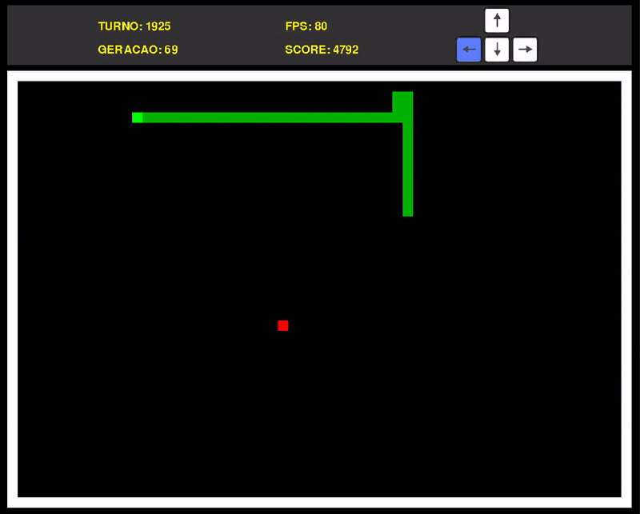

# Neuro-evolutionary Snake
Neuro-evolutionary approach to the creation of an AI capable of playing Snake. To start the program, simply install the requirements and run main.py. A video where I give more details about the project is available on [YouTube](https://www.youtube.com/watch?v=iPUVPpUCf1g).

 
 

